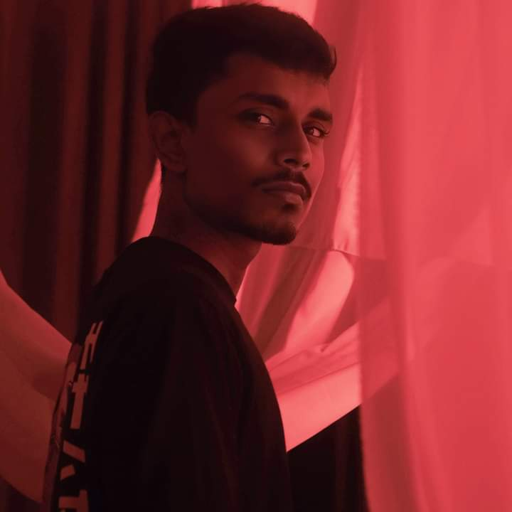
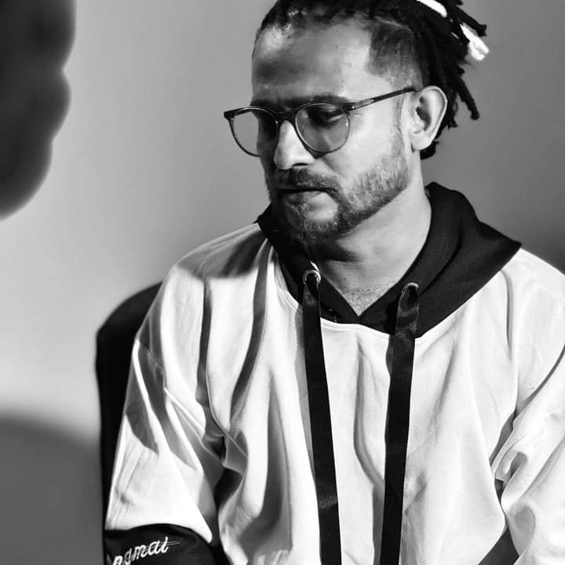
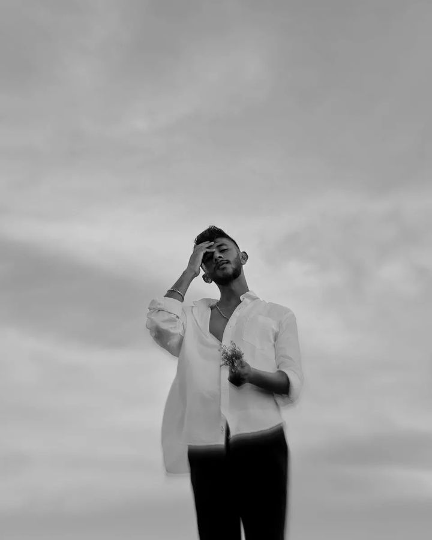
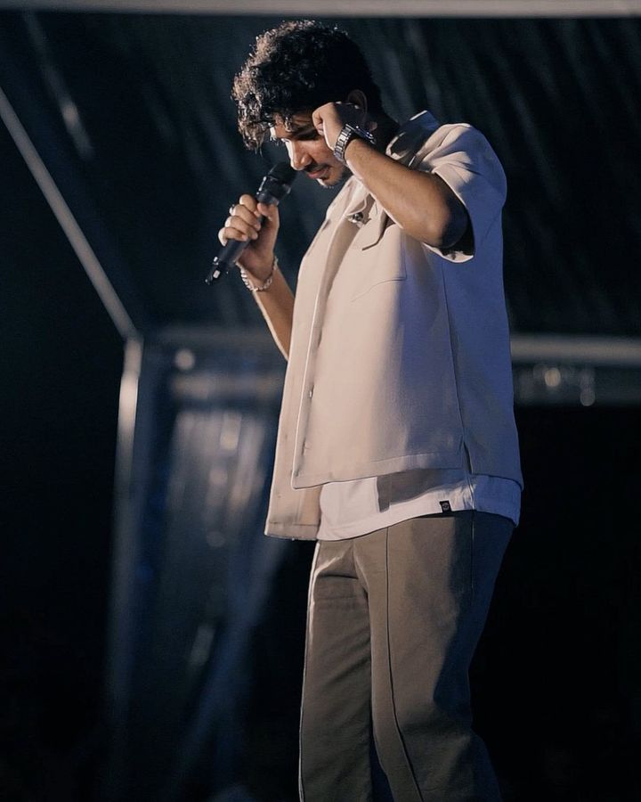

<!DOCTYPE html>
<html lang="en">
<head>
    <meta charset="UTF-8">
    <meta name="viewport" content="width=device-width, initial-scale=1.0">
    <link rel="stylesheet" href="styles.css">
    <title>Sri Lankan Music Industry News & Updates</title>
</head>
<body>
    <header>
        <h1>Lanka Beat</h1>
        
    </header>
    <nav>
        <ul style="font-variant:small-caps;">
            <li><a href="#home">Latest News</a></li>
            <li><a href="#rising-artists">Rising Artists</a></li>
            <li><a href="#music-releases">Music Releases</a></li>
            <li><a href="#concerts-events">Concerts & Events</a></li>
            <li><a href="#about-us">About Us</a></li>
            <li><a href="#feedback">Feedback</a></li>
        </ul>
    </nav>
    <main>
        <section id="Home">
               <h2 style="font-variant:small-caps;">Latest News</h2>
               

                   <h3 style="font-variant:small-caps;">Here are the latest news updates for Rising artists in the Sri Lankan Music Industry:</h3>
                   

                   <B>Dilu Beats:</B> 
                    - Dilu Beats has collaborated with several international artists on a series of tracks, expanding his reach beyond the Sri Lankan music scene. 
                    - He recently launched his own music production academy aimed at nurturing young talent in Sri Lanka and providing them with opportunities to learn from industry professionals.
                     
                    <B>Mihiran:</B> 
                    - Mihiran's music video for his hit single "Mulawe" surpassed 20 million views on YouTube, making it one of the most-watched music videos in Sri Lanka. 
                    - He was honored with the Best Male Artist award at the Sri Lankan Music Awards 2024 for his outstanding contributions to the music industry.
                     
                    <B>Ramidu:</B> 
                    - Ramidu's collaboration with a Bollywood playback singer on the track "Heena Dunnu Adaree" gained popularity in India and Sri Lanka, earning him recognition in both countries. 
                    - He embarked on a nationwide tour to promote his latest album, performing at sold-out concerts in major cities across Sri Lanka.
                     
                    <B>Yuki Navaratne:</B> 
                    - Yuki Navaratne's collaboration with an international DJ on the track "Rasthafari" gained traction on global music charts, further establishing him as a rising star in the international music scene. 
                    - He was invited to perform at several music festivals and events in Asia and Europe, showcasing Sri Lankan music to a global audience.
                     
                    <B>Sasindu Raveen:</B> 
                    - Sasindu Raveen's single "Numba Daka Ma Niwuna" topped the charts in Sri Lanka and received extensive airplay on radio stations nationwide. 
                    - He signed a record deal with a major music label, allowing him to work on his debut album with top producers and songwriters in the industry.
                     
                    <B>Lashan Herath:</B> 
                    - Lashan Herath's collaboration with a renowned fashion brand on a music and fashion showcase received praise from critics and fans alike for its innovative approach to combining music and fashion. 
                    - He was invited to perform at several high-profile events and galas, including charity fundraisers and corporate functions.
                     
                    <B>Iman Fernando:</B> 
                    - Iman Fernando's single "Paalu Yaame" became a viral sensation on social media platforms, receiving millions of views and shares from fans worldwide. 
                    - He launched his own music label aimed at supporting independent artists and providing them with a platform to showcase their talent.
                     
                    <B>Uvindu Ayshcharya:</B> 
                    - Uvindu Ayshcharya's debut album "Sithuwam Hade" received critical acclaim for its poignant lyrics and soulful melodies, establishing him as a promising newcomer in the industry. 
                    - He collaborated with several established artists on remixes of his songs, reaching new audiences and expanding his fanbase.

                     
                  </section>
      <section id="rising-artists">
                <h2 style="font-variant:small-caps;">Rising Artists</h2>
                

                    <h3 style="font-variant:small-caps;">DILU Beats</h3>
                    
                    
 Dileepa (Born:October 12,2001 in Matara,Sri Lanka)  Known professionally as <B>DILU Beats</B>is a producer,Music composer,Arranger & Singer. He works with HipHop,Pop,RnB,Trap,EDM,Classical Music,Modern Music,World music & Many other genres. He currently works as a Music producer at Magampura Records.

                    

                      
                      
                      
                    

                  

                

                    <h3 style="font-variant:small-caps;">Mihiran</h3>
                    
                    
Lakshitha MIhiran,also known as <B>Mihiran</B>,excels as an all-round musician who has mastered Pop,HipHop,Trap & Lofi. Also he is a Sri Lankan Rapper,Composer & Songwriter. One of his releases,<B>"Mulawe"</B>is an all-time hit on social media platforms & reached over 15 million views on YouTube so far & streamed over 4 million times on Spotify and 500K times on Apple Music. And he has been staying on "Top 100:Sri Lanka,Apple Music"and made it into popular playlists on Spotify. In addition,he has done the melody composing work for several songs that became quite famous in Sri Lanka. A successful music career & many new songs will await for him in the future.

                    

                      
                      
                      
                    

                  

                

                    <h3 style="font-variant:small-caps;">Ramidu</h3>
                    
                    
Ramidu Yashmintha (born 31 August 1999),commonly known as Ramidu,is a Sri Lankan Musician,Singer & Music Composer. His works are noted for integrating Pop & RnB.Ramidu's made more hits in the Sri Lankan with came of Nohimi song in music industry.

                    

                      
                      
                      
                    

                  

                

                    <h3 style="font-variant:small-caps;">Yuki Navarathne</h3>
                    
                    
Pannala Gedara Yukthi Prabudika Navaratne aka <B>Yuki Navaratne</B> was born 12 May 1990,known professionally as YukiBeatz, is a Sri Lankan music director,singer,arranger & well-known music producer. His works are noted for integrating HipHop/RnB/Trap with electronic music,world music & modern musical arrangements. With an in-house studio (YukiBeatz)Yuki's career started rising in 2015 witg the famous Sri Lankan rap crew  <B>Drill Team Westnahira</B>& in 2017 with <B>Wasthi</B> he has made more hits in the Sri Lankan music industry. Among Yuki's best tracks are <B>Usama Thanaka,Baisikalaya,Adukule,Nurawani,Kalagotti,Toiya Baiya,Rasthafari,Heenen & Oba Dakala</B>. He has been known as the best modern music creator in the music industry.

                    

                      
                      
                      
                    

                  

                

                    <h3 style="font-variant:small-caps;">Sasindu Raveen</h3>
                    
                    
Sasindu Raveen is a former contestant of <B>The Voice Teens Sri Lanka</B> who reached the finals.Discover the multifaceted talent of Sasindu Raveen on Spotify.As a prolific songwriter,masterful melody composer,captivating singer & dynamic performer,Sasindu's music transcends genres & captivates audiences worldwide,In 2022 he participated The Voice Teens & got selected to the Lahiru Perera's team.He found his success island wide with his second song <B> 'Numba Daka Ma Niwuna'</B>.

                    

                      
                      
                      
                    

                  

                

                    <h3 style="font-variant:small-caps;">Lashan Herath</h3>
                    
                    
Lashan Herath,a rising star in the SrinLankan Sinhala pop music scene,is making waves with his unique style & captivating performances,Born & raised in Nuwara Eliya,Sri Lanka,Lashan discovered his passion for music at an early age & has since dedicated himself to honing his craft. From his early years,Lashan displayed a natural talent for singing & songwriting.Inspired by a diverse range  of musical genres,he developed a signature sound that seamlessly blends elements of pop,rock & traditional Sri Lankan melodies.His songs are characterized by infectious hooks,heartfelt lyrics & powerful vocals that resonate with listeners.Lashan's journey as a professional musician began when he released his debut single,<B>"Hith ochcham"</B> which quickly gained traction on local radio stations & online platforms.The success of his first release solidified his position as a promising artist & opened doors to collaborate with renowned producers & songwriters.

                    

                      
                      
                      
                    

                  

                

                    <h3 style="font-variant:small-caps;">Iman Fernando</h3>
                    
                    
Iman Sasanka Fernando also known as Iman Fernando,ia a Sri Lankan Singer,Songwriter & Composer,The audience got to know him from his 3rd single called <B>Paalu Yaame</B>.Born & raised in Wattala,Sri Lanka. Iman Sasanka Fernando taught himself guitar at the age of 15. Inspired from that,he started his cover series at the age of 17.After he started to make his own melodies & lyrics. When he was his in 20's he met one of the leading producer & artist named Dileepa Madushan also known as <B>DILU Beats</B>. He dropped his debut single <B>Ape Kathawa</B> at the age of 20.Among his songs,his personal favourite is <B>Aley Ma</B> which is the second song that he released. He has been mark his position on "top 100:Sri Lanka" chart & made it into popular playlists on Spotify.Iman's music more into Lofi pop,pop & RnB soul. He hopes to make his name an indelible name in the Sri Lankan music scene.

                    

                      
                      
                      
                    

                  

                

                    <h3 style="font-variant:small-caps;">Uvindu Ayshcharya</h3>
                    
                    
Uvindu Ayshcharya,an upcoming Artist in Sri Lankan Sinhala pop,hip-pop,trap & lofi music scene & he is a Song writer & composer. Most of the people know him from his 3rd song <B>Sithuwam Hade</B> song with DILU Beats.Born & raised in Matara,Sri Lanka. The goal is to create a successful musical journey in the future.

                    

                      
                      
                      
                    

                  

            </section>
        
     <section id="music-releases">
            <h2 style="font-variant:small-caps;">Music Releases</h2>
            

              <h3 style="font-variant:small-caps;">"Mawila" by DILU Beats</h3>
            

            <audio id="myAudio" controls>
              <source src="Mawila.mp3" type="audio/mpeg">
            </audio>
            

              <h3 style="font-variant:small-caps;">"Dase Durin" by DILU Beats</h3>
            

            <audio id="myAudio" controls>
              <source src="Dase Durin.mp3" type="audio/mpeg">
            </audio>
            

                <h3 style="font-variant:small-caps;">"Numba Ha" by DILU Beats</h3>
            

            <audio id="myAudio" controls>
              <source src="Numba Ha.mp3" type="audio/mpeg">
            </audio>
            

              <h3 style="font-variant:small-caps;">"Neth Manema" by DILU Beats</h3>
            

            <audio id="myAudio" controls>
              <source src="Neth Manema.mp3" type="audio/mpeg">
            </audio>
            

              <h3 style="font-variant:small-caps;">"Mulawe" by Mihiran </h3>
            

            <audio id="myAudio" controls>
              <source src="Mulawe.mp3" type="audio/mpeg">
            </audio>
            

              <h3 style="font-variant:small-caps;">"Sanda Nena Da" by Mihiran </h3>
            

            <audio id="myAudio" controls>
              <source src="Sanda Nena Da.mp3" type="audio/mpeg">
            </audio>
            

              <h3 style="font-variant:small-caps;">"Wanapasa Male" by Mihiran </h3>
            

            <audio id="myAudio" controls>
              <source src="Wanapasa Male.mp3" type="audio/mpeg">
            </audio>
            

              <h3 style="font-variant:small-caps;">"Riduman" by Mihiran </h3>
            

            <audio id="myAudio" controls>
              <source src="Riduman.mp3" type="audio/mpeg">
            </audio>
            

              <h3 style="font-variant:small-caps;">"Maga Haree" by Mihiran </h3>
            

            <audio id="myAudio" controls>
              <source src="Maga Haree.mp3" type="audio/mpeg">
            </audio>
            

              <h3 style="font-variant:small-caps;">"Nohimi" by Ramidu </h3>
            

            <audio id="myAudio" controls>
              <source src="Nohimi.mp3" type="audio/mpeg">
            </audio>
            

              <h3 style="font-variant:small-caps;">"Pihatuwak Se" by Ramidu </h3>
            

            <audio id="myAudio" controls>
              <source src="Pihatuwak.mp3" type="audio/mpeg">
            </audio>
            

              <h3 style="font-variant:small-caps;">"Kaalayakata Kalin" by Ramidu </h3>
            

            <audio id="myAudio" controls>
              <source src="Kaalayakata Kalin.mp3" type="audio/mpeg">
            </audio>
            

              <h3 style="font-variant:small-caps;">"Heena Dunnu Adaree" by Ramidu </h3>
            

            <audio id="myAudio" controls>
              <source src="Heena Dunnu.mp3" type="audio/mpeg">
            </audio>
            

              <h3 style="font-variant:small-caps;">"Manali" by Yuki Navaratne </h3>
            

            <audio id="myAudio" controls>
              <source src="Nuba Widda.mp3" type="audio/mpeg">
            </audio>
            

              <h3 style="font-variant:small-caps;">"Wisithuru Mal" by Yuki Navaratne </h3>
            

            <audio id="myAudio" controls>
              <source src="Wisithuru Mal.mp3" type="audio/mpeg">
            </audio>
            

              <h3 style="font-variant:small-caps;">"Lantharum" by Yuki Navaratne </h3>
            

            <audio id="myAudio" controls>
              <source src="Lantharum.mp3" type="audio/mpeg">
            </audio>
            

              <h3 style="font-variant:small-caps;">"Mata Samawenna" by Yuki Navaratne </h3>
            

            <audio id="myAudio" controls>
              <source src="Mata Samawenna.mp3" type="audio/mpeg">
            </audio>
            

              <h3 style="font-variant:small-caps;">"Manabandu Karanawak" by Yuki Navaratne </h3>
            

            <audio id="myAudio" controls>
              <source src="ManaBanduu.mp3" type="audio/mpeg">
            </audio>
            

              <h3 style="font-variant:small-caps;">"Ill Mahe Kurullo" by Yuki Navaratne </h3>
            

            <audio id="myAudio" controls>
              <source src="Ill Mahe.mp3" type="audio/mpeg">
            </audio>
            

              <h3 style="font-variant:small-caps;">"Nohithunata" by Yuki Navaratne </h3>
            

            <audio id="myAudio" controls>
              <source src="Nohithunata.mp3" type="audio/mpeg">
            </audio>
            

              <h3 style="font-variant:small-caps;">"Sankawe Ma" by Sasindu Raveen </h3>
            

            <audio id="myAudio" controls>
              <source src="Sankawe Ma.mp3" type="audio/mpeg">
            </audio>
            

              <h3 style="font-variant:small-caps;">"Numba Daka Ma" by Sasindu Raveen </h3>
            

            <audio id="myAudio" controls>
              <source src="Nuba Daka.mp3" type="audio/mpeg">
            </audio>
            

              <h3 style="font-variant:small-caps;">"Hith Ochcham" by Lashan Herath </h3>
            

            <audio id="myAudio" controls>
              <source src="Hith Ochcham.mp3" type="audio/mpeg">
            </audio>
            

              <h3 style="font-variant:small-caps;">"Dathin Allan" by Lashan Herath </h3>
            

            <audio id="myAudio" controls>
              <source src="Dathin Allan.mp3" type="audio/mpeg">
            </audio>
            

              <h3 style="font-variant:small-caps;">"Sali Sali" by Lashan Herath </h3>
            

            <audio id="myAudio" controls>
              <source src="Sali Sali.mp3" type="audio/mpeg">
            </audio>
            

              <h3 style="font-variant:small-caps;">"Paalu Yaame" by Iman Fernando </h3>
            

            <audio id="myAudio" controls>
              <source src="Paalu Yame.mp3" type="audio/mpeg">
            </audio>
            

              <h3 style="font-variant:small-caps;">"Hangannada Adare" by Iman Fernando </h3>
            

            <audio id="myAudio" controls>
              <source src="Hangannada Adare.mp3" type="audio/mpeg">
            </audio>
            

              <h3 style="font-variant:small-caps;">"Sewanella Se" by Uvindu Ayshcharya </h3>
            

            <audio id="myAudio" controls>
              <source src="Sewanella Se.mp3" type="audio/mpeg">
            </audio>
            

              <h3 style="font-variant:small-caps;">"Sithuwam Hade" by Uvindu Ayshcharya </h3>
            

            <audio id="myAudio" controls>
              <source src="Sithuwam Hade.mp3" type="audio/mpeg">
            </audio>
        </section>
        
      <section id="concerts-events">
            <h2 style="font-variant:small-caps;">Concerts & Events</h2>
            

                    
<B style="color:#000754;" >"RIDMA HENDEWA 2.0"</B> on the 26th of April 2024 | 06.00 PM Onwards | Kadolkale Grounds, Negombo   
                      FT : Ashanya Premadasa | Centigradz | Mihiran | Piyath Rajapaksha | Ridma Weerawardana

                    
<B style="color:#000754;" >"PREMIDHARI LIVE IN CONCERT"</B> on 17th of May 2024 | 07.00 PM Onwards | Bogambara Prison, Kandy  
                      FT : Anjitha Kuruppu | Nipuni Herath | Mihiran | Lashan Herath | Mahiru Senarathne | Ramidu Yashmintha | DILU Beats | Iman Fernando | Bhashi Devanga | Music by Yaka Crew

                    
<B style="color:#000754;" >"PRASHASTHI LIVE IN CONCERT"</B> on the 31st of May 2024 | 07.00 PM Onwards | Taprobane Rajagiriya  
                      FT : Nadeemal | Dinesh | Kaizer | Yuki | Ravi J | Music by Ants

                

        </section> 
      <section id="about-us">
            <h2 style="font-variant:small-caps;">About Us</h2>
            

                <h3 style="font-variant:small-caps;color:#000754;">Who We Are</h3>
                
We are Lanka Beat, your ultimate source for the latest news, updates, and insights from the vibrant Sri Lankan music industry. With a passion for music and a dedication to promoting local talent, we strive to bring you the most comprehensive coverage of everything happening in the world of Sri Lankan music.

            

            

                <h3 style="font-variant:small-caps;color:#000754;">Our Mission</h3>
                
Our mission is to support and uplift the Sri Lankan music industry by showcasing emerging talent, providing in-depth interviews with industry professionals, and keeping you informed about the latest music releases, concerts, and events. We believe in the power of music to unite communities and celebrate cultural diversity.

            

            

              <h3 style="font-variant:small-caps;color:#000754;">Contact Us</h3>
              
If you have any questions, suggestions, or would like to contribute to Lanka Beat, please feel free to reach out to us at <a href="mailto:info@lankabeat.com">info@lankabeat.com</a>. We'd love to hear from you!

          

        </section>
        <section id="feedback">
          <h2 style="font-variant:small-caps;">Your feedback matters!</h2>
          <form id="feedback">
              <textarea id="feedback" placeholder="Write your comment here..." required></textarea>
              <button type="submit">Submit</button>
              
 Thank you for taking the time to provide your valuble feedback. 

          </form>
          <ul id="feedback">  
            
          </ul>
      </section>
    </main>
    <footer>
      

          
Contact Us : +94762945946

          
At Mihintale Town

          
Email Us At : <a href="Info@LankaBeat.com">Info@LankaBeat.com</a>

          
Follow Us :

          

          
          
          
          
  
           
          
&copy; 2024 LankaBeat. All Rights Reserved.

      

    </footer>
 
</body>
</html>
